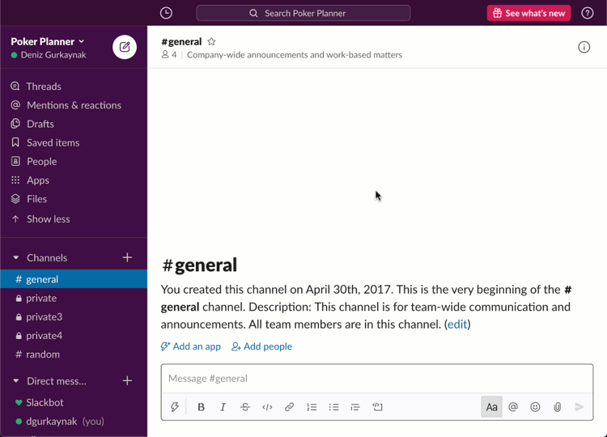

# Poker Planner for Slack

This project lets you make estimations with planning poker technique (or scrum poker) directly in Slack, without any need of external software.
It can be a useful tool for agile remote teams.

Slack App Directory: https://slack.com/apps/A57FFS3QE-poker-planner

[](https://deniz.co/slack-poker-planner/)

## Installation & Add to your Slack Team

- Go to website: https://deniz.co/slack-poker-planner/
- Click **"Add to Slack"** button
- Select the team you want to install Poker Planner from the dropdown top right
- Click **Allow** button

## Usage

For detailed usage documentation, please visit [website](https://deniz.co/slack-poker-planner/#usage).

## Self-hosting

If you want to host your own app, follow this steps:

### Creating Slack App & Getting Credentials

- Create a new Slack app [from here](https://api.slack.com/apps).
- Interactivity & Shortcuts
  - **Turn on** "Interactivity"
  - Set request url: `http://my.awesome.project.url/slack/interactivity`
- Slash Commands
  - Create a new command `/pp` (or any command you want) and set request url as `http://my.awesome.project.url/slack/pp-slash-command`
  - Make sure that "Escape channels, users, and links sent to your app" option is **turned on**
- OAuth & Permissions
  - Add a new OAuth Redirect URL: `http://my.awesome.project.url/oauth`
  - Required bot permission scopes: `commands`, `chat:write`
  - Required user permission scopes: None
- User ID Translation
  - **Turn off** "Translate Global IDs"
- Tokens
  - Client ID, Secret and Verification token can be found on Basic Information page
- Installation
  - Go to Manage Distribution, click "Add to Slack" and grant permissions

### Running via Docker

- Clone the repo & `cd` into it
- Build docker image: `docker build -t dgurkaynak/slack-poker-planner .`
- Start container:
```sh
docker run -d \
  --restart=unless-stopped \
  -p 3000:3000 \
  -e SLACK_CLIENT_ID=xxx \
  -e SLACK_CLIENT_SECRET=xxx \
  -e SLACK_VERIFICATION_TOKEN=xxx \
  -e SLACK_APP_ID=xxx \
  -e DATA_FOLDER=/data \
  -e ENABLE_JSONL_LOGGING=true \
  -v /host/data/folder/slack-poker-planner:/data \
  --name slack-poker-planner \
  dgurkaynak/slack-poker-planner
```
- *(optional)* If you wanna persist poker sessions, you can provide a Redis server.
```sh
docker run -d \
  --restart=unless-stopped \
  -p 3000:3000 \
  -e SLACK_CLIENT_ID=xxx \
  -e SLACK_CLIENT_SECRET=xxx \
  -e SLACK_VERIFICATION_TOKEN=xxx \
  -e SLACK_APP_ID=xxx \
  -e DATA_FOLDER=/data \
  -e ENABLE_JSONL_LOGGING=true \
  -v /host/data/folder/slack-poker-planner:/data \
  -e USE_REDIS=true \
  -e REDIS_URL="redis://X.X.X.X:6379" \
  --name slack-poker-planner \
  dgurkaynak/slack-poker-planner
```

> Check out [.env.default](https://github.com/dgurkaynak/slack-poker-planner/blob/master/.env.default) file for the complete list of environment variables.

### Running Manually

Node.js requirement `>= 22.11.0`

- Clone this repo
- Install dependencies: `npm i`
- Build: `npm run build`
- Start the app: `npm start`

